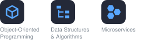

<!--
  Hugo Eliezer Trejo — GitHub Profile README
  ============================================
  Source of truth: CV (September 2026). Nothing invented — no fabricated
  projects, tech, certifications, or profiles. Fully self-contained.

  Maintenance notes
  - Tech Stack: one SVG per category, stack-*.svg in the repo root. Tiles use
    the skillicons.dev style; skillicons tiles are copied from
    tandpfun/skill-icons (MIT). Other logos: Simple Icons (CC0; LinkedIn, AWS,
    SharePoint and Power Automate from v10.4.0, since removed upstream),
    Devicon (MIT), SVG Logos (CC0), VS Code Icons (MIT), File Icons (MIT),
    Material Design Icons (Apache-2.0). Each file is standalone: to add a tool,
    copy one <svg x=...> tile + <text> block and shift x by 100.
  - Badges are reference-style images defined at the BOTTOM of this file.
    Logos removed from Simple Icons are embedded as base64 SVG in `logo=`.
  - Review every semester: semester number and "in progress" dates.
  - If the GitHub username changes, search & replace "HugoTrejo13".
-->

# 👋 Hi, I'm Hugo Eliezer Trejo

**Computer Science Engineering Student · Backend (Java & Spring Boot) · AWS Certified**

 

[![LinkedIn][b-linkedin]](https://linkedin.com/in/hugo-eliezer-trejo)
[![Email][b-email]](mailto:hugo.trejo02@gmail.com)
[![GitHub][b-github]](https://github.com/HugoTrejo13)

 

## 🧭 About Me

I'm a Computer Science Engineering student at Universidad de Guadalajara (CUTONALA) with a 94.13/100 GPA, graduating in December 2027. My technical focus is backend development with Java and Spring Boot, microservices, and cloud on AWS.

At iNBest I was the PM counterpart to four engineering teams, turning client needs into backlog items and sprint plans — so I know how client software gets delivered end-to-end, not just how it gets written. I communicate clearly with technical and non-technical stakeholders and take full ownership of what I work on.

 

## 🔭 Current Focus

- 🎯 Looking for a **Software Development** or **Cloud Engineering** role
- 📚 Learning **Microservices with Spring Boot & Spring Cloud** — in progress, est. December 2026
- ☁️ **AWS Certified Cloud Practitioner** — valid through February 2029
- 💼 Recently completed a **PMO Internship** at iNBest — delivery governance, data migrations & workflow automation

 

## 🛠️ Tech Stack

<!-- One image per category, stored in the repo root as stack-*.svg -->

**Languages**

**Frameworks**

**Concepts**

**Databases**

**Cloud & Infrastructure**

**Project & PM Tools**

**Developer Tools**

**Methodologies**

 

## 🏆 Featured Project

### HPE Stock Rotation Automation

![VBA][b-vba]
![SAP][b-sap]

🏅 *Top 6 Finalist — HPE Innovation Challenge 2026* · `May 2026`

- Built an Excel VBA tool that parses SAP S/4HANA reports (VA05, VF05) and computes CAP balances across AMS-region distributors, replacing a manual spreadsheet process.
- Reduced a 5-hour workflow to under 3 minutes (>99% faster) with single-click execution and zero setup cost.

> Internal business-automation deliverable; source is not publicly available.

 

## 💼 Professional Experience

### Project Management Office (PMO) Intern — iNBest
`July 2025 – May 2026` · Guadalajara, Jalisco, Mexico · On-site / Remote

- **Automation** — Gathered requirements from PM stakeholders and prototyped a Power Automate integration syncing Microsoft Project and Azure DevOps data, eliminating manual duplicate entry.
- **Delivery** — Acted as PM counterpart to 4 engineering teams across 8+ concurrent client software projects, translating client needs into backlog items and sprint plans in Azure DevOps.
- **Data migrations & reporting** — Standardized recurring Excel-to-Azure DevOps data migrations across 4 teams (Software Factory, Data, Cloud, Innovation) and centralized weekly status reporting in SharePoint as a single source of truth.
- **Tool evaluation** — Evaluated AI transcription tools (Fireflies vs. Read.ai) against PMO needs and presented a recommendation to senior leadership, improving documentation turnaround.

 

## 🎓 Education

**Universidad de Guadalajara — CUTONALA**
Bachelor of Science in Computer Science Engineering
`2024 – 2027` · GPA 94.13/100 · 6th Semester · Expected: December 2027
Guadalajara, Jalisco, Mexico

**Relevant coursework:** Data Structures, Algorithms, Object-Oriented Programming, Databases, Operating Systems

 

## 📜 Certifications

| Certification | Issuer | Status |
|:---|:---|:---|
| ![AWS Certified Cloud Practitioner][c-aws] | Amazon Web Services | Valid through Feb 2029 |
| ![Scrum Fundamentals Certified (SFC)][c-sfc] | SCRUMstudy | Completed |

### 📚 Courses

| Course | Provider | Status |
|:---|:---|:---|
| ![Master Microservices with Spring Boot and Spring Cloud][c-udemy] | Udemy | In progress · Est. Dec 2026 |
| ![Claude Code in Action (AI Developer Tools)][c-claude] | Anthropic | Completed |
| ![Google Prompting Essentials (Specialization)][c-google] | Google | Completed Jun 2026 |

 

## 📊 GitHub Analytics

<!--
  Stats / Top Languages / Trophy use community mirrors (github-stats-extended,
  github-profile-trophy-kannan) instead of the original anuraghazra/ryo-ma
  public endpoints, which are heavily shared and prone to rate-limit outages.
  Streak and Activity Graph use their own separate services.
-->

 

## 🌐 Languages

| Language | Level |
|:---|:---|
| Spanish | Native |
| English | Upper-Intermediate (B2) · Professional working proficiency |

 

## 📫 Contact

[![LinkedIn][b-linkedin]](https://linkedin.com/in/hugo-eliezer-trejo)
[![Email][b-email]](mailto:hugo.trejo02@gmail.com)
[![GitHub][b-github]](https://github.com/HugoTrejo13)

 

📍 Guadalajara, Jalisco, Mexico · UTC-6

<!-- ─── Badge definitions (reference-style images; edit badges here) ─── -->

[b-linkedin]: https://img.shields.io/badge/LinkedIn-0A66C2?style=for-the-badge&logo=data:image%2Fsvg%2Bxml;base64,PHN2ZyB4bWxucz0iaHR0cDovL3d3dy53My5vcmcvMjAwMC9zdmciIHZpZXdCb3g9IjAgMCAyNCAyNCI%2BPHBhdGggZmlsbD0iI2ZmZiIgZD0iTTIwLjQ0NyAyMC40NTJoLTMuNTU0di01LjU2OWMwLTEuMzI4LS4wMjctMy4wMzctMS44NTItMy4wMzctMS44NTMgMC0yLjEzNiAxLjQ0NS0yLjEzNiAyLjkzOXY1LjY2N0g5LjM1MVY5aDMuNDE0djEuNTYxaC4wNDZjLjQ3Ny0uOSAxLjYzNy0xLjg1IDMuMzctMS44NSAzLjYwMSAwIDQuMjY3IDIuMzcgNC4yNjcgNS40NTV2Ni4yODZ6TTUuMzM3IDcuNDMzYy0xLjE0NCAwLTIuMDYzLS45MjYtMi4wNjMtMi4wNjUgMC0xLjEzOC45Mi0yLjA2MyAyLjA2My0yLjA2MyAxLjE0IDAgMi4wNjQuOTI1IDIuMDY0IDIuMDYzIDAgMS4xMzktLjkyNSAyLjA2NS0yLjA2NCAyLjA2NXptMS43ODIgMTMuMDE5SDMuNTU1VjloMy41NjR2MTEuNDUyek0yMi4yMjUgMEgxLjc3MUMuNzkyIDAgMCAuNzc0IDAgMS43Mjl2MjAuNTQyQzAgMjMuMjI3Ljc5MiAyNCAxLjc3MSAyNGgyMC40NTFDMjMuMiAyNCAyNCAyMy4yMjcgMjQgMjIuMjcxVjEuNzI5QzI0IC43NzQgMjMuMiAwIDIyLjIyMiAwaC4wMDN6Ii8%2BPC9zdmc%2B
[b-email]: https://img.shields.io/badge/Email-EA4335?style=for-the-badge&logo=gmail&logoColor=white
[b-github]: https://img.shields.io/badge/GitHub-181717?style=for-the-badge&logo=github&logoColor=white
[b-vba]: https://img.shields.io/badge/VBA-512BD4?style=for-the-badge&logo=data:image%2Fsvg%2Bxml;base64,PHN2ZyB4bWxucz0iaHR0cDovL3d3dy53My5vcmcvMjAwMC9zdmciIHZpZXdCb3g9IjAgMCAyNCAyNCI%2BPHBhdGggZmlsbD0iI2ZmZiIgZD0iTTYuMzYzIDE3LjcxOWE3LjU3IDcuNTcgMCAwIDEgLjM0LTEuMzQ4TDEwLjg4NyA0LjVoMS44NjNsLTUuNDczIDE1aC0xLjkxTDAgNC41aDEuOTM0bDQuMDkgMTEuODk1Yy4wNzguMjE4LjE0LjQzNy4xODcuNjU2cy4wOTguNDQxLjE1Mi42Njh6TTIwLjY2IDExLjUzYy41LjA2My45NTcuMTg4IDEuMzcxLjM3NXMuNzY2LjQ0MiAxLjA1NS43NjIuNTEyLjY5MS42NjggMS4xMTMuMjM4Ljg5LjI0NiAxLjQwNmMwIC42OTYtLjEzMyAxLjMxLS4zOTggMS44NHMtLjYyMi45OC0xLjA2NyAxLjM0OC0uOTYuNjQ1LTEuNTQ3LjgzMi0xLjIwMy4yODUtMS44NTEuMjkzaC00LjM3MXYtMTVoNC4yNjVjLjU0IDAgMS4wNTkuMDY2IDEuNTU5LjJzLjk1LjMzNSAxLjM0OC42MDkuNzE0LjYyOC45NDkgMS4wNjYuMzU1Ljk1Ny4zNjMgMS41NTljMCAuODU5LS4yMjcgMS42MDEtLjY4IDIuMjI2cy0xLjA5IDEuMDY3LTEuOTEgMS4zMjR2LjA0N3ptLTQuMTM3LS41OTdoMS43OTNjLjQzIDAgLjgzMi0uMDUxIDEuMjA3LS4xNTNzLjcwNC0uMjU4Ljk4NS0uNDY5LjUtLjQ4OC42NTYtLjgzMi4yMzgtLjc0Ni4yNDYtMS4yMDdjMC0uNDMtLjA3OC0uNzg1LS4yMzQtMS4wNjZzLS4zNjctLjUwNC0uNjMzLS42NjgtLjU3LS4yNzctLjkxNC0uMzQtLjcwNy0uMDk3LTEuMDktLjEwNWgtMi4wMTZ2NC44NHptMi4zOCA2Ljk3MmMuNDM3IDAgLjg1LS4wNSAxLjI0Mi0uMTUycy43MzgtLjI2MiAxLjA0My0uNDguNTM5LS41LjcwMy0uODQ0LjI1NC0uNzYyLjI3LTEuMjU0YzAtLjU0LS4xMDItLjk4LS4zMDYtMS4zMjRzLS40NzYtLjYxNC0uODItLjgwOS0uNzMtLjMzMi0xLjE2LS40MS0uODc1LS4xMTctMS4zMzYtLjExN2gtMi4wMTZ2NS4zOWgyLjM4eiIvPjwvc3ZnPg%3D%3D
[b-sap]: https://img.shields.io/badge/SAP-0FAAFF?style=for-the-badge&logo=sap&logoColor=white
[c-aws]: https://img.shields.io/badge/-AWS_Certified_Cloud_Practitioner-232F3E?style=flat-square&logo=data:image%2Fsvg%2Bxml;base64,PHN2ZyB4bWxucz0iaHR0cDovL3d3dy53My5vcmcvMjAwMC9zdmciIHZpZXdCb3g9IjAgMCAyNCAyNCI%2BPHBhdGggZmlsbD0iI2ZmZiIgZD0iTTYuNzYzIDEwLjAzNmMwIC4yOTYuMDMyLjUzNS4wODguNzEuMDY0LjE3Ni4xNDQuMzY4LjI1Ni41NzYuMDQuMDYzLjA1Ni4xMjcuMDU2LjE4MyAwIC4wOC0uMDQ4LjE2LS4xNTIuMjRsLS41MDMuMzM1YS4zODMuMzgzIDAgMCAxLS4yMDguMDcyYy0uMDggMC0uMTYtLjA0LS4yMzktLjExMmEyLjQ3IDIuNDcgMCAwIDEtLjI4Ny0uMzc1IDYuMTggNi4xOCAwIDAgMS0uMjQ4LS40NzFjLS42MjIuNzM0LTEuNDA1IDEuMTAxLTIuMzQ3IDEuMTAxLS42NyAwLTEuMjA1LS4xOTEtMS41OTYtLjU3NC0uMzkxLS4zODQtLjU5LS44OTQtLjU5LTEuNTMzIDAtLjY3OC4yMzktMS4yMy43MjYtMS42NDQuNDg3LS40MTUgMS4xMzMtLjYyMyAxLjk1NS0uNjIzLjI3MiAwIC41NTEuMDI0Ljg0Ni4wNjQuMjk2LjA0LjYuMTA0LjkxOC4xNzZ2LS41ODNjMC0uNjA3LS4xMjctMS4wMy0uMzc1LTEuMjc3LS4yNTUtLjI0OC0uNjg2LS4zNjctMS4zLS4zNjctLjI4IDAtLjU2OC4wMzEtLjg2My4xMDMtLjI5NS4wNzItLjU4My4xNi0uODYyLjI3MmEyLjI4NyAyLjI4NyAwIDAgMS0uMjguMTA0LjQ4OC40ODggMCAwIDEtLjEyNy4wMjNjLS4xMTIgMC0uMTY4LS4wOC0uMTY4LS4yNDd2LS4zOTFjMC0uMTI4LjAxNi0uMjI0LjA1Ni0uMjhhLjU5Ny41OTcgMCAwIDEgLjIyNC0uMTY3Yy4yNzktLjE0NC42MTQtLjI2NCAxLjAwNS0uMzZhNC44NCA0Ljg0IDAgMCAxIDEuMjQ2LS4xNTFjLjk1IDAgMS42NDQuMjE2IDIuMDkxLjY0Ny40MzkuNDMuNjYyIDEuMDg1LjY2MiAxLjk2M3YyLjU4NnptLTMuMjQgMS4yMTRjLjI2MyAwIC41MzQtLjA0OC44MjItLjE0NC4yODctLjA5Ni41NDMtLjI3MS43NTgtLjUxLjEyOC0uMTUyLjIyNC0uMzIuMjcyLS41MTIuMDQ3LS4xOTEuMDgtLjQyMy4wOC0uNjk0di0uMzM1YTYuNjYgNi42NiAwIDAgMC0uNzM1LS4xMzYgNi4wMiA2LjAyIDAgMCAwLS43NS0uMDQ4Yy0uNTM1IDAtLjkyNi4xMDQtMS4xOS4zMi0uMjYzLjIxNS0uMzkuNTE4LS4zOS45MTcgMCAuMzc1LjA5NS42NTUuMjk1Ljg0Ni4xOTEuMi40Ny4yOTYuODM4LjI5NnptNi40MS44NjJjLS4xNDQgMC0uMjQtLjAyNC0uMzA0LS4wOC0uMDY0LS4wNDgtLjEyLS4xNi0uMTY4LS4zMTFMNy41ODYgNS41NWExLjM5OCAxLjM5OCAwIDAgMS0uMDcyLS4zMmMwLS4xMjguMDY0LS4yLjE5MS0uMmguNzgzYy4xNTEgMCAuMjU1LjAyNS4zMS4wOC4wNjUuMDQ4LjExMy4xNi4xNi4zMTJsMS4zNDIgNS4yODQgMS4yNDUtNS4yODRjLjA0LS4xNi4wODgtLjI2NC4xNTEtLjMxMmEuNTQ5LjU0OSAwIDAgMSAuMzItLjA4aC42MzhjLjE1MiAwIC4yNTYuMDI1LjMyLjA4LjA2My4wNDguMTIuMTYuMTUxLjMxMmwxLjI2MSA1LjM0OCAxLjM4MS01LjM0OGMuMDQ4LS4xNi4xMDQtLjI2NC4xNi0uMzEyYS41Mi41MiAwIDAgMSAuMzExLS4wOGguNzQzYy4xMjcgMCAuMi4wNjUuMi4yIDAgLjA0LS4wMDkuMDgtLjAxNy4xMjhhMS4xMzcgMS4xMzcgMCAwIDEtLjA1Ni4ybC0xLjkyMyA2LjE3Yy0uMDQ4LjE2LS4xMDQuMjYzLS4xNjguMzExYS41MS41MSAwIDAgMS0uMzAzLjA4aC0uNjg3Yy0uMTUxIDAtLjI1NS0uMDI0LS4zMi0uMDgtLjA2My0uMDU2LS4xMTktLjE2LS4xNS0uMzJsLTEuMjM4LTUuMTQ4LTEuMjMgNS4xNGMtLjA0LjE2LS4wODcuMjY0LS4xNS4zMi0uMDY1LjA1Ni0uMTc3LjA4LS4zMi4wOHptMTAuMjU2LjIxNWMtLjQxNSAwLS44My0uMDQ4LTEuMjI5LS4xNDMtLjM5OS0uMDk2LS43MS0uMi0uOTE4LS4zMi0uMTI4LS4wNzEtLjIxNS0uMTUxLS4yNDctLjIyM2EuNTYzLjU2MyAwIDAgMS0uMDQ4LS4yMjR2LS40MDdjMC0uMTY3LjA2NC0uMjQ3LjE4My0uMjQ3LjA0OCAwIC4wOTYuMDA4LjE0NC4wMjQuMDQ4LjAxNi4xMi4wNDguMi4wOC4yNzEuMTIuNTY2LjIxNS44NzguMjc5LjMxOS4wNjQuNjMuMDk2Ljk1LjA5Ni41MDIgMCAuODk0LS4wODggMS4xNjUtLjI2NGEuODYuODYgMCAwIDAgLjQxNS0uNzU4Ljc3Ny43NzcgMCAwIDAtLjIxNS0uNTU5Yy0uMTQ0LS4xNTEtLjQxNi0uMjg3LS44MDctLjQxNWwtMS4xNTctLjM2Yy0uNTgzLS4xODMtMS4wMTQtLjQ1NC0xLjI3Ny0uODEzYTEuOTAyIDEuOTAyIDAgMCAxLS40LTEuMTU4YzAtLjMzNS4wNzMtLjYzLjIxNi0uODg2LjE0NC0uMjU1LjMzNS0uNDc5LjU3NS0uNjU0LjI0LS4xODQuNTEtLjMyLjgzLS40MTUuMzItLjA5Ni42NTUtLjEzNiAxLjAwNi0uMTM2LjE3NSAwIC4zNTkuMDA4LjUzNS4wMzIuMTgzLjAyNC4zNS4wNTYuNTE4LjA4OC4xNi4wNC4zMTIuMDguNDU1LjEyNy4xNDQuMDQ4LjI1Ni4wOTYuMzM2LjE0NGEuNjkuNjkgMCAwIDEgLjI0LjIuNDMuNDMgMCAwIDEgLjA3MS4yNjN2LjM3NWMwIC4xNjgtLjA2NC4yNTYtLjE4NC4yNTZhLjgzLjgzIDAgMCAxLS4zMDMtLjA5NiAzLjY1MiAzLjY1MiAwIDAgMC0xLjUzMi0uMzExYy0uNDU1IDAtLjgxNS4wNzEtMS4wNjIuMjIzLS4yNDguMTUyLS4zNzUuMzgzLS4zNzUuNzEgMCAuMjI0LjA4LjQxNi4yNC41NjcuMTU5LjE1Mi40NTQuMzA0Ljg3Ny40NGwxLjEzNC4zNThjLjU3NC4xODQuOTkuNDQgMS4yMzcuNzY3LjI0Ny4zMjcuMzY3LjcwMi4zNjcgMS4xMTcgMCAuMzQzLS4wNzIuNjU1LS4yMDcuOTI2LS4xNDQuMjcyLS4zMzYuNTExLS41ODMuNzAzLS4yNDguMi0uNTQzLjM0My0uODg2LjQ0Ny0uMzYuMTExLS43MzQuMTY3LTEuMTQyLjE2N3pNMjEuNjk4IDE2LjIwN2MtMi42MjYgMS45NC02LjQ0MiAyLjk2OS05LjcyMiAyLjk2OS00LjU5OCAwLTguNzQtMS43LTExLjg3LTQuNTI2LS4yNDctLjIyMy0uMDI0LS41MjcuMjcyLS4zNTEgMy4zODQgMS45NjMgNy41NTkgMy4xNTMgMTEuODc3IDMuMTUzIDIuOTE0IDAgNi4xMTQtLjYwNyA5LjA2LTEuODUyLjQzOS0uMi44MTQuMjg3LjM4My42MDd6TTIyLjc5MiAxNC45NjFjLS4zMzYtLjQzLTIuMjItLjIwNy0zLjA3NC0uMTAzLS4yNTUuMDMyLS4yOTUtLjE5Mi0uMDYzLS4zNiAxLjUtMS4wNTMgMy45NjctLjc1IDQuMjU0LS4zOTkuMjg3LjM2LS4wOCAyLjgyNi0xLjQ4NSA0LjAwNy0uMjE1LjE4NC0uNDIzLjA4OC0uMzI3LS4xNTEuMzItLjc5IDEuMDMtMi41Ny42OTUtMi45OTR6Ii8%2BPC9zdmc%2B
[c-sfc]: https://img.shields.io/badge/-Scrum_Fundamentals_Certified-2E8B57?style=flat-square&logo=data:image%2Fsvg%2Bxml;base64,PHN2ZyB4bWxucz0iaHR0cDovL3d3dy53My5vcmcvMjAwMC9zdmciIHZpZXdCb3g9IjAgMCAyNCAyNCI%2BPHBhdGggZmlsbD0iI2ZmZiIgZD0iTTQgM2MtMS4xMSAwLTIgLjg5LTIgMnYxMGEyIDIgMCAwIDAgMiAyaDh2NWwzLTNsMyAzdi01aDJhMiAyIDAgMCAwIDItMlY1YTIgMiAwIDAgMC0yLTJ6bTggMmwzIDJsMy0ydjMuNWwzIDEuNWwtMyAxLjVWMTVsLTMtMmwtMyAydi0zLjVMOSAxMGwzLTEuNXpNNCA1aDV2Mkg0em0wIDRoM3YySDR6bTAgNGg1djJINHoiLz48L3N2Zz4%3D
[c-udemy]: https://img.shields.io/badge/-Master_Microservices_with_Spring_Boot_%26_Spring_Cloud-A435F0?style=flat-square&logo=udemy&logoColor=white
[c-claude]: https://img.shields.io/badge/-Claude_Code_in_Action-D97757?style=flat-square&logo=claude&logoColor=white
[c-google]: https://img.shields.io/badge/-Google_Prompting_Essentials-4285F4?style=flat-square&logo=google&logoColor=white
